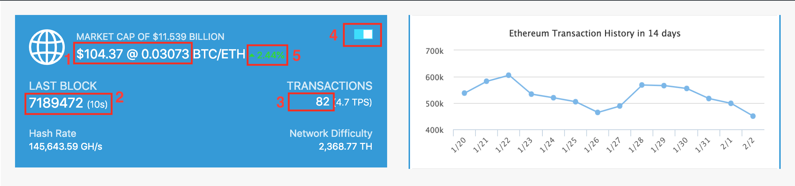
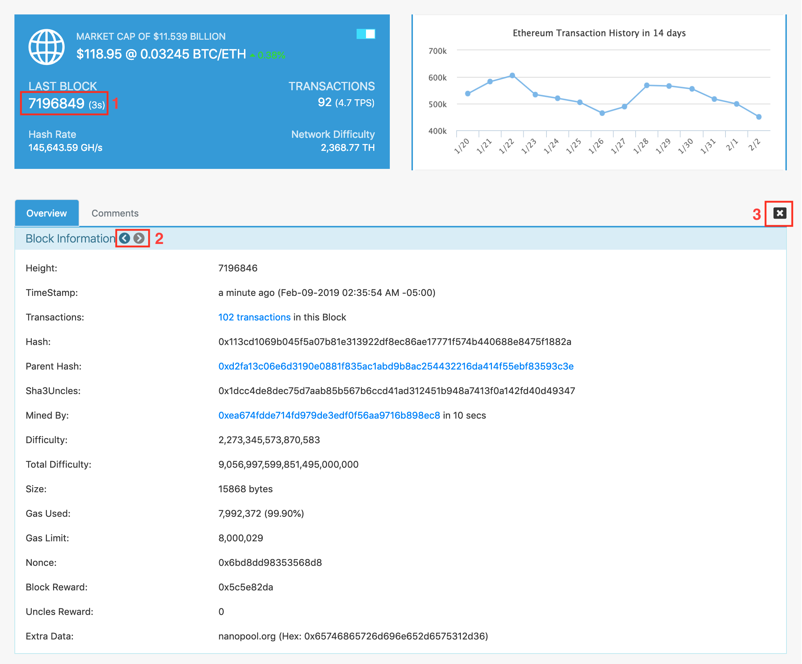

# Full Stack Development I
>**`Student information:`**
>- **`101227911` -- Tony Phuong Nguyen**
>- **`101229105` -- Eric Choi**

# Requirement #1 - Display to users a blue box


```language
Accoring to red rectangles in image #1:
#1. Display last price in USD and in BTC
#2. Display last block number, and time of the block creation
#3. Display total transactions of last block
#4. Toggle realtime update button. If it's enabled, it will automatically get data and update (if any) each 7 seconds
#5. Display percentage of price as rise/fall (b/c we don't have enough data to calculate it, we use mock data to show how it works, we create a random number: if it's even then the index is rise, it's fall if the number is odd)

Note: the chart beside is just an image.
```

# Requirement #2 - Display a block information


```language
Accoring to red rectangles in image #2:
#1. Click on the last block number, it will show its information container
#2. Click navigation buttons to navigate next and previous a block
#3. Click close button to close block information container
```